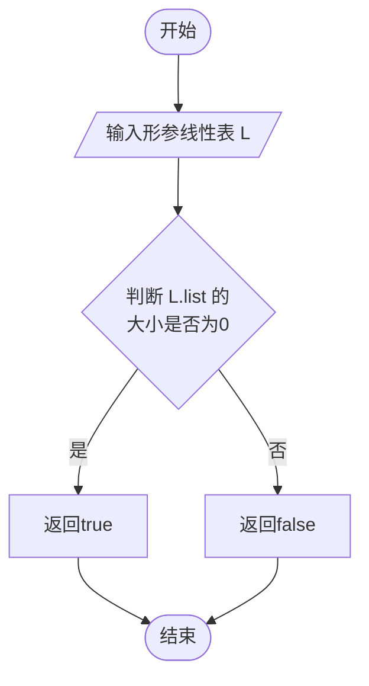
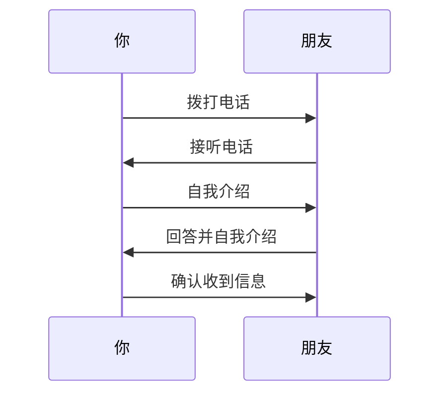
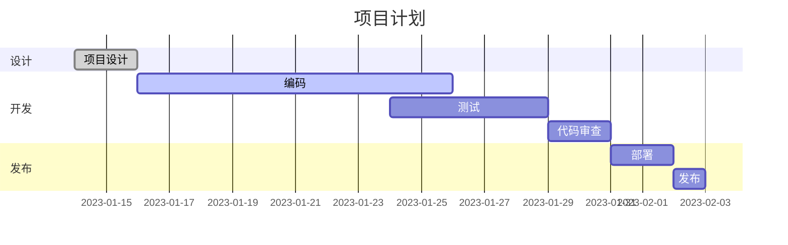

# Mermaid：抛弃「画图」，拥抱「码图」

Mermaid 是一个可以让你通过代码来绘制流程图、序列图、甘特图等各种图表的工具。

## Mermaid 的优势

相比于传统的绘图软件，Mermaid 的优势在于：

- 代码可复用：你可以将代码保存下来，方便以后进行修改和维护。
- 易于协作：你可以将代码分享给其他人，让他们也可以轻松地修改和维护图表。
- 方便集成：你可以将 Mermaid 集成到自己的项目中，方便自己和其他人使用。

## Typora 启用 Mermaid

不同系统配置方法有些许不同。

### MacOS

如果你是MacOS系统，那么只需要简单几步操作就可以在文章中使用 Mermaid 了。具体步骤如下：

1. 打开 Typora，点击菜单栏中的「偏好设置」按钮。
2. 在「偏好设置」窗口中，点击「Markdown」标签页。
3. 在「Markdown」标签页中，勾选「图标」复选框。
   

### Windows

Windows系统，


## Mermaid 语法

Mermaid 的语法非常简单，以下是一些常用的语法示例：

### 流程图

```
flowchart TD
    start([开始]) --> input[/输入形参线性表 L/]
    input --> op1{判断L.list的大小是否为0};
    op1 -- 是 --> op2[返回true];
    op1 -- 否 --> op3[返回false];
    op2 --> Stop([结束]);
    op3 --> Stop([结束]);
```



### 序列图

```
sequenceDiagram
  participant 你
  participant 朋友

  你->>朋友: 拨打电话
  朋友->>你: 接听电话
  你->>朋友: 自我介绍
  朋友->>你: 回答并自我介绍
  你->>朋友: 确认收到信息
```




### 甘特图

```
gantt
    title 项目计划
    dateFormat  YYYY-MM-DD
    section 设计
    项目设计     :done,    des, 2023-01-14,2023-01-16
    section 开发
    编码         :active,  dev, 2023-01-16, 10d
    测试         :         test, 2023-01-24, 5d
    代码审查     :         review, after test, 2d
    section 发布
    部署         :         deploy, after review, 2d
    发布         :         release, after deploy, 1d
```



更多语法示例可以参考 Mermaid 的[官方文档](https://mermaid-js.github.io/mermaid/#/).


## Mermaid 在线编辑

用这个[官方在线编辑器](https://mermaid.live/edit)在线解释你的 Mermaid 语法，并提供强大的导出功能，并完全免费。它甚至**自带图床**！~~这不香死。~~


官网还提供了另一个[在线编辑器](https://www.mermaidchart.com/)，相比于上一个编辑器，这个编辑器可以保存的你图表项目。并且即将推出多人协作功能，不过需要收费。具体支持功能以及价格见下图：

